# PHP Webshells collection

**Disclaimer**: all scripts listed below are only for testing/pentesting purposes.

* Original Readme with tons of useful information = [/Docs/original-readme.md](/Docs/original-readme.md)
* Dump of all script names that I've found while webbrowsing - [/Docs/raw-shell-list.md](/Docs/raw-shell-list.md)
* 
Please, remember - cybercrime is also a crime.

## Database

* **MySQL/rmdb.php** - deletes database + checks existence of specified tables for control
* **MySQL/rps.php** - small database discovery + changing user password to specified one

## Filesystem
* **rmfs.php** - recursively removes all folders and files in specified folder 

## Trash
Some stuff that I've found while cleaning different infected sites. 

**P.S.** I am not an author, Use it for your own risk. Possible duplicates with `Shells/` section (obfuscated, base64-encoded, maybe)

**P.S.S.** not presented in this repository due to security reasons

## Shells
(thx for sites https://privdayz.com/, https://www.hackingtool.net and http://www.topshellv.com for information)

* **[b374k](https://github.com/b374k/b374k)** - b374k shell is the most used of the world is one of the shells. With this shell you can easily navigate through the servers you enter. you can take advantage of all file permissions, and you can use many tools. It is a multifunctional php shell
  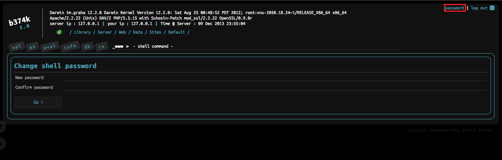
* **[p0wny@shell](https://github.com/flozz/p0wny-shell)** - pintesting utility set
* **[kali linux web shells](https://www.kali.org/tools/webshells/)**
* **aspx-shell** - asp shell is a file that runs on asp servers. With this shell, you can easily hack servers and browse easily on the server. It's one of the best asp shells in the world. The most used shell is the aspx shell. With the easy interface, you can comfortably overcome the security of many servers.
  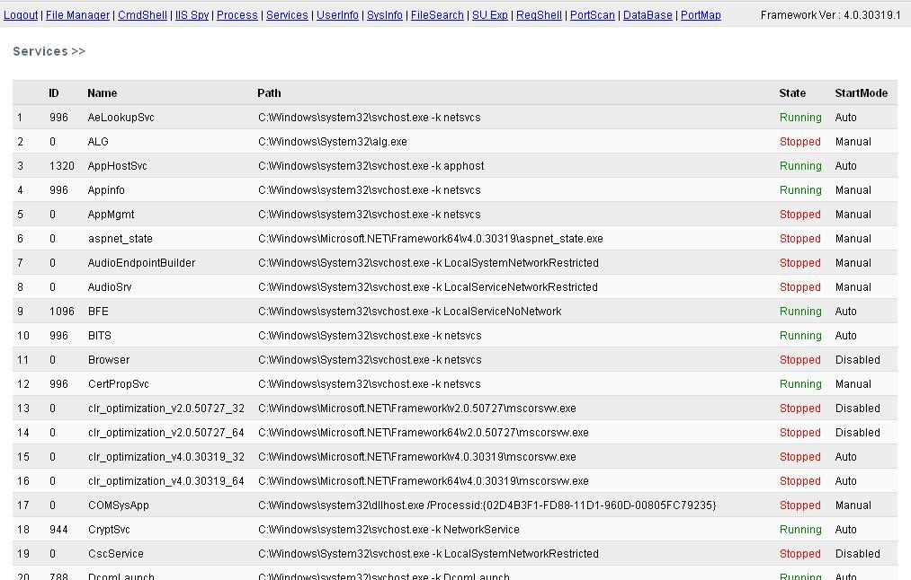
* **R57 shell** - r57 shell is the most used php shell in the world. With this shell, which contains many features, there are many add-ons that allow you to navigate between servers and bypass the security of many servers. This shell, which allows you to connect to the sql server, has got the first line of hackers' most preferred shells.
  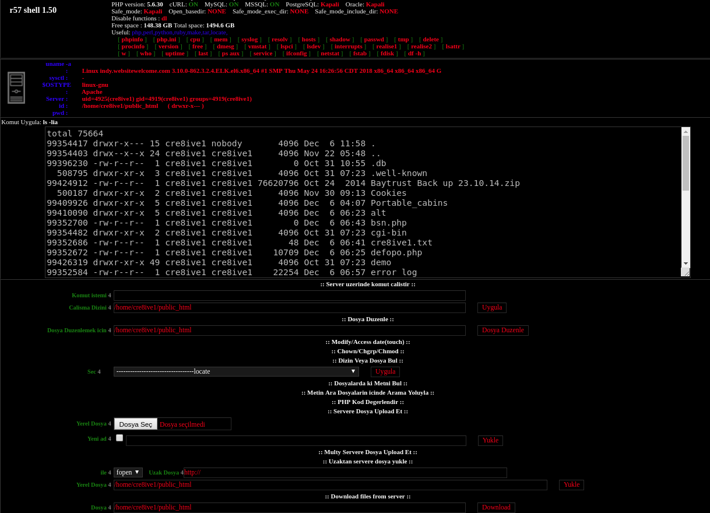
* **[C99 Shell](https://github.com/4Hackerz/C99-Shell) / [PHP-7 version](https://github.com/KaizenLouie/C99Shell-PHP7)** - this shell is among the most robust sheller in the world. It is the most used and secure shelf that literally breaks through. With a simple interface, you can easily get to the server on the other side, and you can also get into the sql server section. This shell have different functions, such as brute force.
  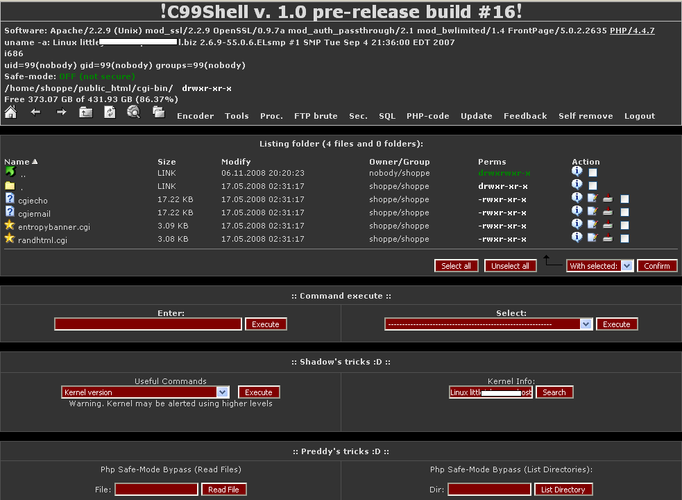
* **Webadmin Shell** - Because Webadmin shell has a simple image and does not contain much malicious code inside it, it has been observed that it is not easy to catch firewalls. If you are having trouble getting firewalls, you are looking for the shell webadmin php shell.
  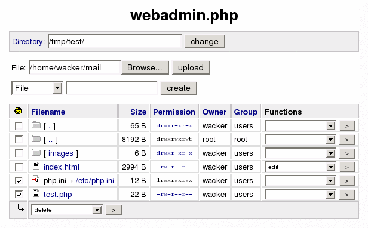
* **s3ven shell** - With this shell from 2017, you can make server busses more stable. 
  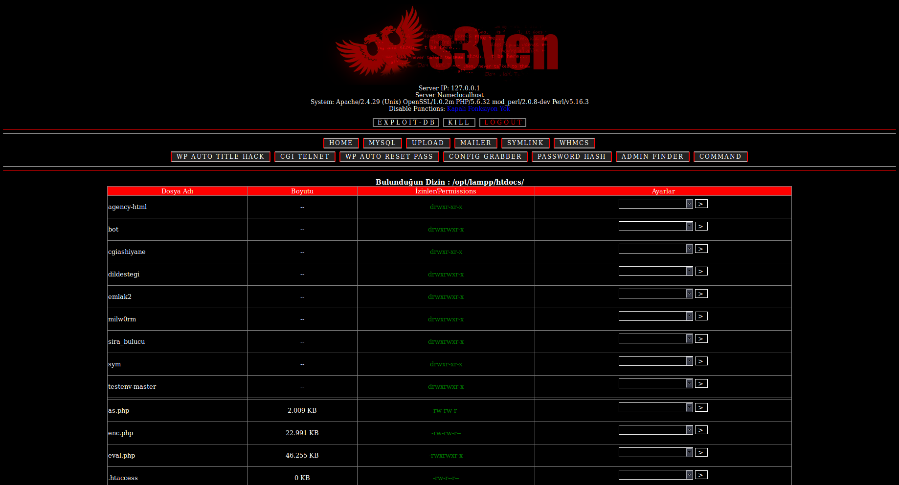
* **Mini Shell** - The smallest feature of the mini shell is its small size, which allows you to easily navigate through hacked servers without getting caught easily by the server admin. It is the shell mini shell that most of the Hacklink friends use.
  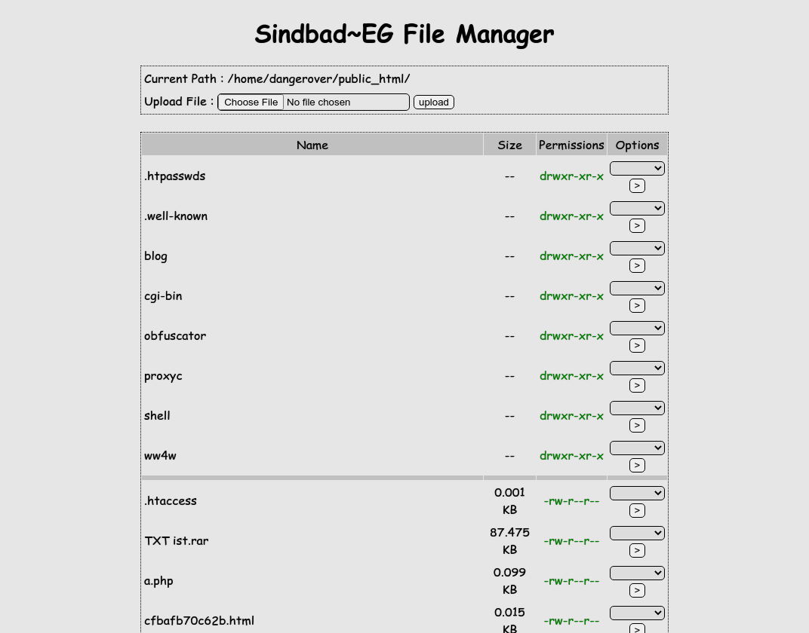
* **IndoXploit Shell V3** - IndoXploit Shell has been mentioned repeatedly by coder who writes that it will you can easily bypass server security. With this shell you can comfortably skip safeguard the most secure servers. It is one of the hackers' most preferred sheller indoxploit shell v3
  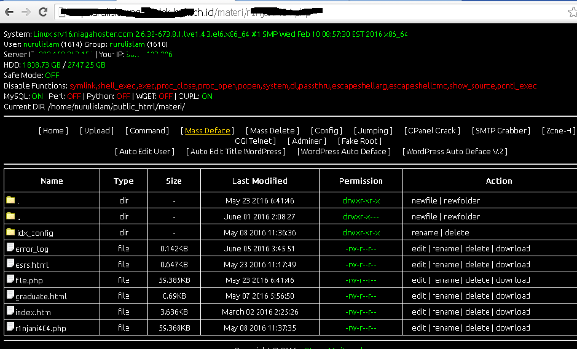
  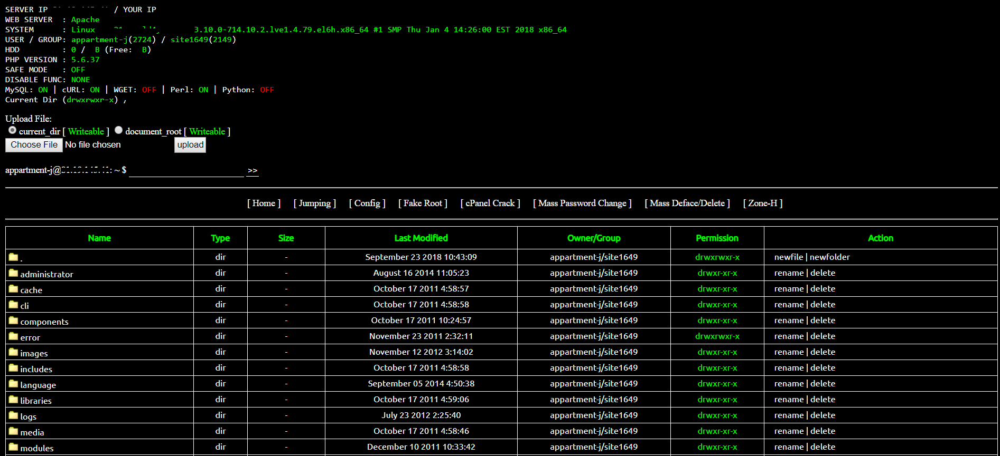
* **wso shell** - You can download wso php shell with a great look. On Php servers you can easily navigate through the directories and hack the sql server.
  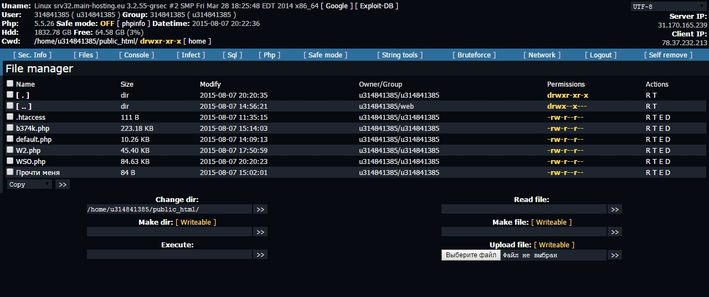
* **Miyachung JS/PHP Web Shell**
  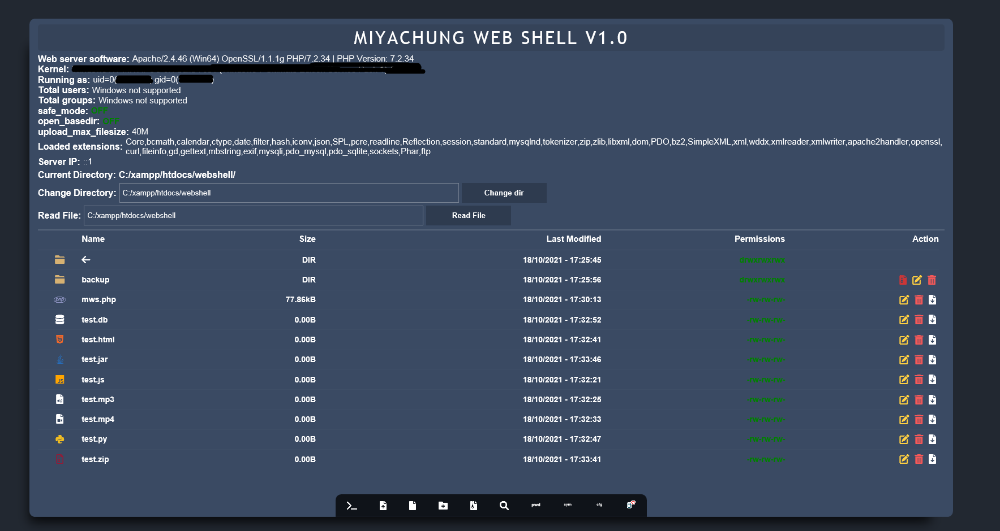
* **Adminer Mysql Php**
  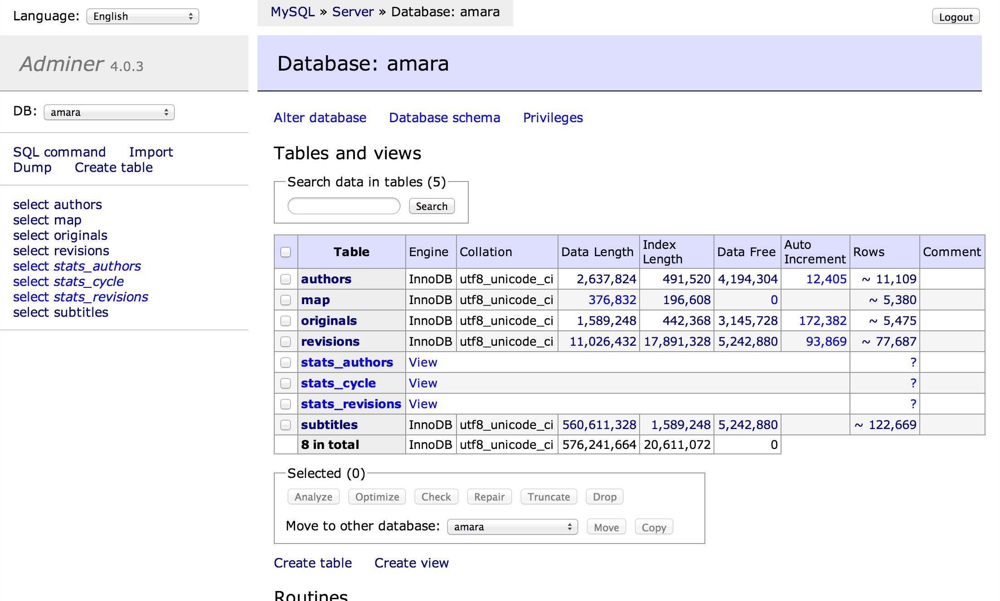
* **Marijuana Shell**
  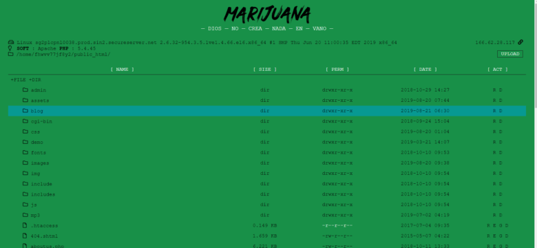
* **Alfa shell**
  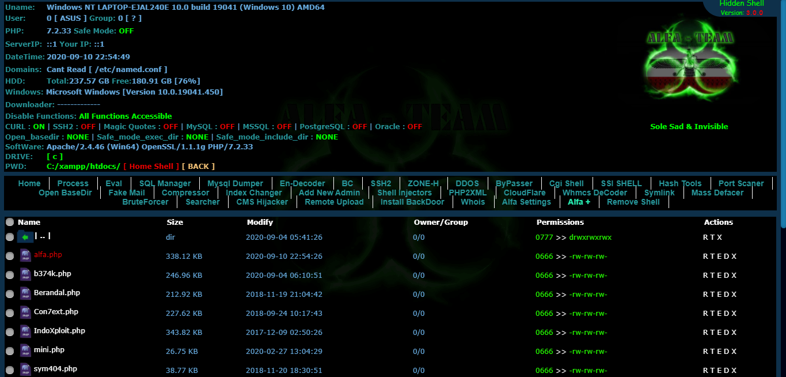
* **MiniShell**
  
* **IndoSec Shell**
  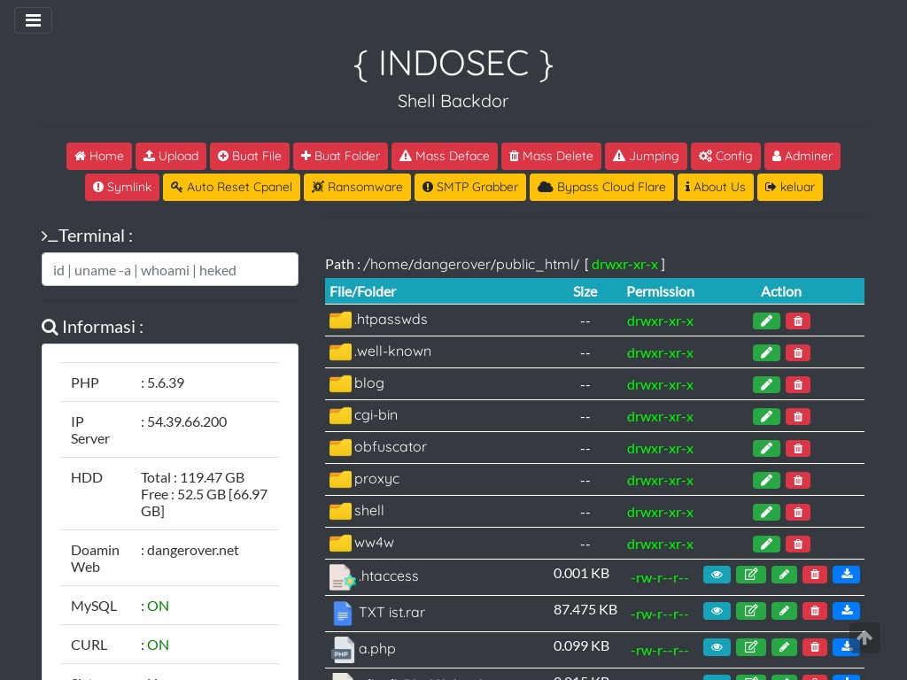
* **ASPXspy2 Shell**
  
* **Andela V3 Shell**
  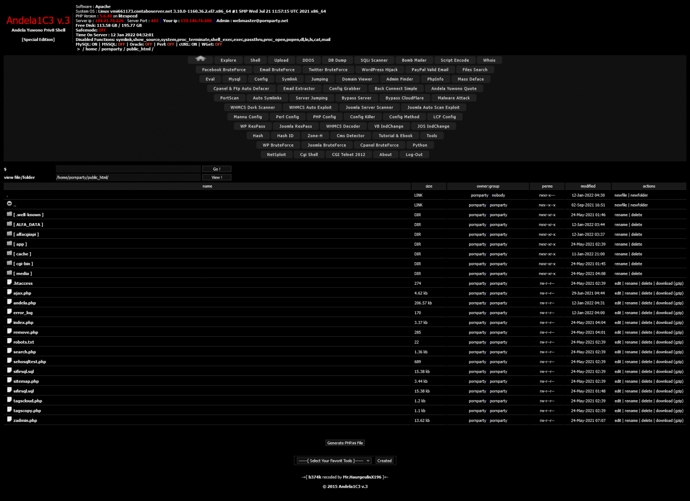